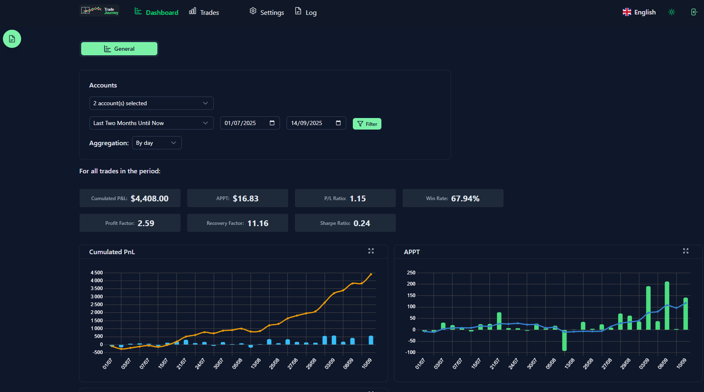
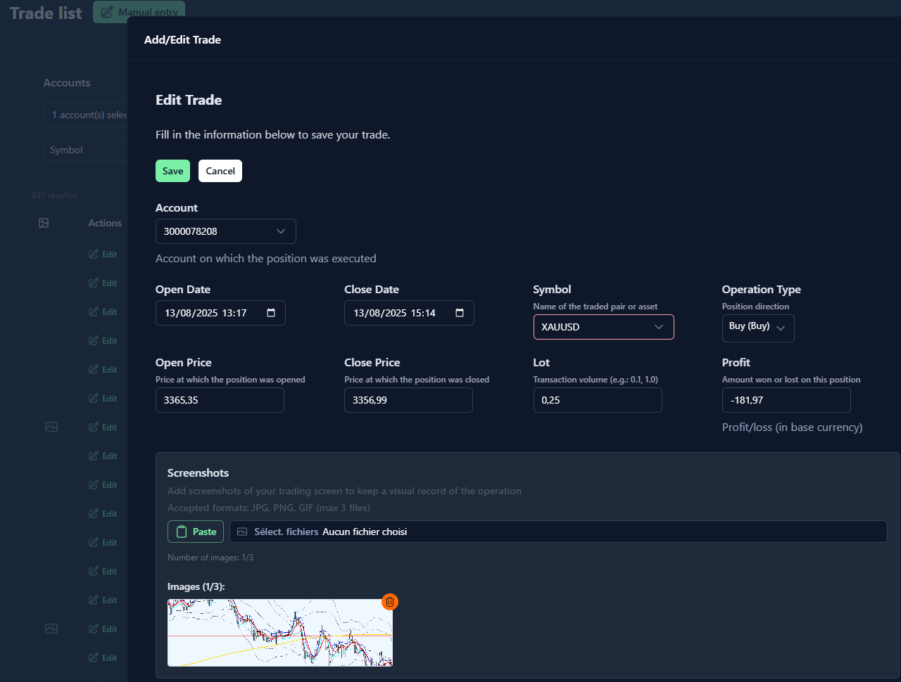
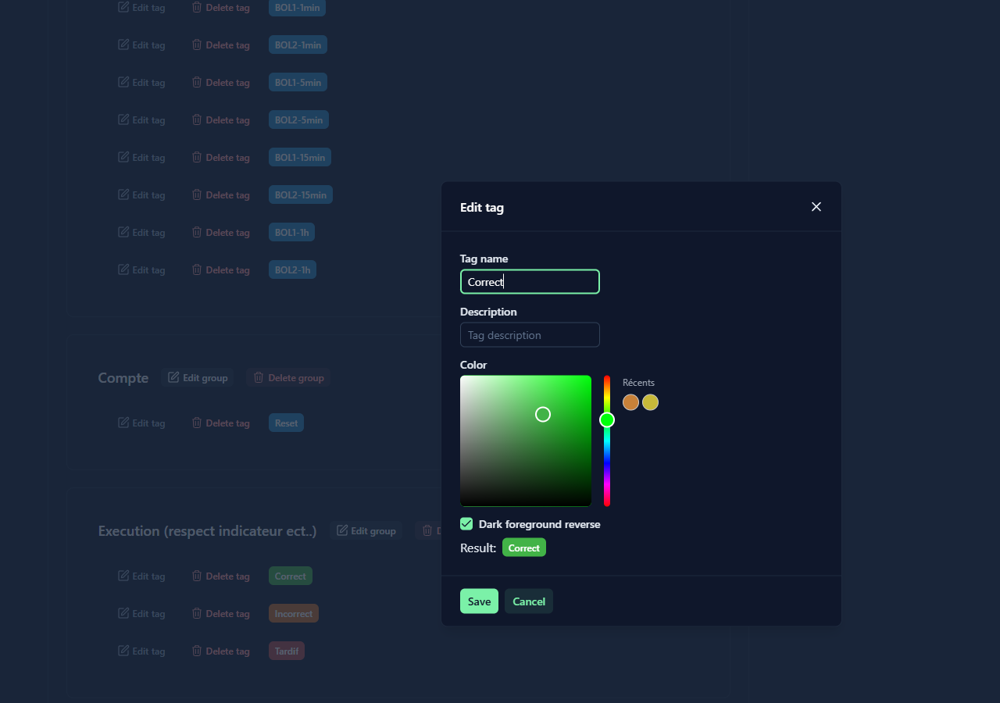
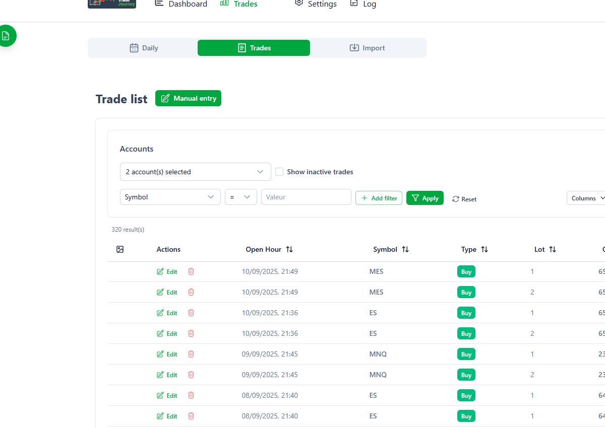

# 📊 TradeJourney - Journal de Trading

**TradeJourney** est une application web moderne de journal de trading développée avec Nuxt 3, permettant aux traders de suivre, analyser et optimiser leurs performances de trading.

<!-- 🖼️ AJOUTEZ ICI UNE CAPTURE D'ÉCRAN DE L'APPLICATION -->

*Tableau de bord principal de TradeJourney*

## ✨ Fonctionnalités

- 📈 **Suivi des trades** : Enregistrement détaillé de tous vos trades avec profit/perte 
- 📥 **Importation** : Importation des trades depuis Metatrader 5 / NinjaTrader 8
- 📊 **Analyses avancées** : Graphiques et statistiques de performance
- 🏷️ **Système de tags** : Organisation et catégorisation de vos trades que vous pouvez associé à la journée ou à chaque trade.
- 📝 **Notes quotidiennes** : Journal de trading avec éditeur riche
- 📸 **Screenshots** : Attachement d'images à vos trades
- 🌓 **Mode sombre/clair** : Interface adaptable avec thème sombre et clair
- 🌍 **Multilingue** : Support français et anglais
- 📱 **Responsive** : Compatible mobile et desktop
- 💾 **Backup/Restore** : Sauvegarde et restauration des données


<!-- 🖼️ CAPTURES D'ÉCRAN DES FONCTIONNALITÉS -->

### Ajout et édition de trades


*Interface d'ajout et d'édition de trades*

L'interface d'ajout de trades permet de :
- Saisir les détails essentiels du trade (symbole, type, date, prix)
- Joindre des captures d'écran du graphique pour référence future
- Actuellement, vous pouvez importer vos trades depuis Metatrader 5 / NinjaTrader 8

### Gestion des tags


*Interface de gestion des tags*

Le système de tags vous permet de :
- Catégoriser vos trades par stratégie, émotion, ou résultat
- Personnaliser les couleurs pour une identification visuelle rapide
- Appliquer des tags à des journées entières ou à des trades spécifiques

### Mode clair/sombre


*Interface en mode clair*


## 🛠️ Technologies

- **Frontend** : Nuxt 3, Vue 3, TypeScript
- **UI** : Nuxt UI, TailwindCSS
- **Base de données** : SQLite avec Prisma ORM
- **Graphiques** : Chart.js

## 🚀 Installation et Déploiement

### Prérequis

- Node.js 20.x ou supérieur
- pnpm (recommandé) ou npm
- SQLite

### Installation locale

1. **Cloner le repository**
```bash
git clone https://github.com/yopkool29/tradeJourney.git
cd tradejourney
```

2. **Créer un fichier .env**
```bash
cp .env.example .env
```

3. **Installer les dépendances**
```bash
pnpm install
# ou
npm install
```

4. **Database configuration**
```bash
# Create the database

# npx prisma db push

npx prisma generate

npx prisma migrate deploy

DATABASE_URL="file:./dev.db" node scripts/create-user.mjs
```

5. **Lancer en mode développement**
```bash
pnpm dev
# ou
npm run dev
```

L'application sera accessible sur `http://localhost:3000`

### 🔑 Connexion par défaut

- **Email** : `admin@mail.fr`
- **Mot de passe** : `admin`

### 🐳 Déploiement avec Docker

```bash
# Construire et lancer
./docker-build.sh
./docker-start.sh

```

L'application sera accessible sur http://localhost:3000

## 🧪 Tests

```bash
# Lancer tous les tests
npx vitest run tests

# Tests spécifiques
npx vitest run tests/mt5-parser.test.ts
npx vitest run tests/nt-parser.test.ts

```

## 📊 Fonctionnalités

### Gestion des Trades
- Import automatique depuis MT5/NT8
- Calcul automatique des P&L
- Attachement de screenshots multiples par trades

### Analyses et Statistiques
- Graphiques de performance par semaine / mois
- Métriques (Sharpe ratio, drawdown, etc.)

### Système de Tags
- Tags personnalisables par groupe
- Couleurs et descriptions
- Filtrage avancé des trades
- Tags quotidiens pour le contexte marché

## 🤝 Contribution

1. Fork le projet
2. Créer une branche feature (`git checkout -b feature/AmazingFeature`)
3. Commit vos changements (`git commit -m 'Add some AmazingFeature'`)
4. Push vers la branche (`git push origin feature/AmazingFeature`)
5. Ouvrir une Pull Request

## 📝 Licence

Ce projet est sous licence Apache 2.0. Voir le fichier [LICENSE](LICENSE.txt) pour plus de détails. 
Je me réserve le droit de déployer le projet sur serveur.

## 🆘 Support

- 🐛 Issues : [GitHub Issues](https://github.com/yopkool29/tradeJourney/issues)
