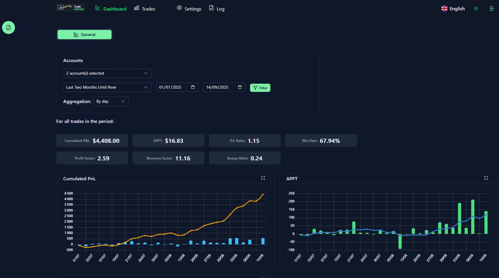
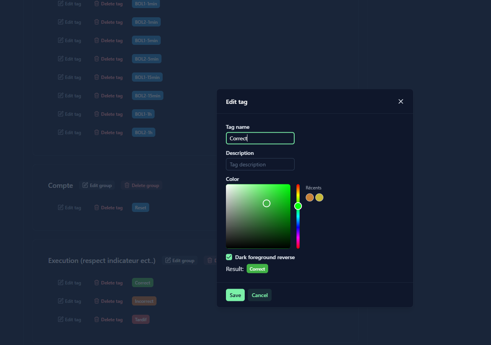
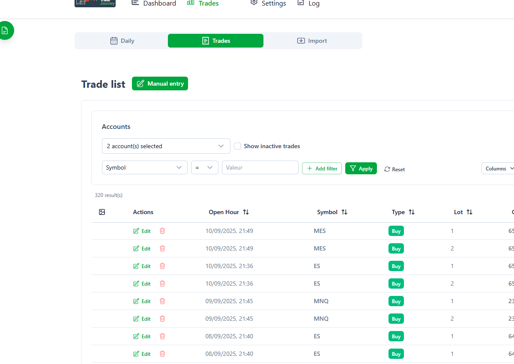

# 📊 TradeJourney - Trading Journal

**TradeJourney** is a modern trading journal web application developed with Nuxt 3, allowing traders to track, analyze, and optimize their trading performance.


*TradeJourney main dashboard*

## ✨ Features

- 📈 **Trade Tracking**: Detailed recording of all your trades with profit/loss
- 📥 **Import**: Import trades from Metatrader 5 / NinjaTrader 8
- 📊 **Advanced Analytics**: Performance charts and statistics
- 🏷️ **Tag System**: Organize and categorize your trades by day or individually
- 📝 **Daily Notes**: Trading journal with rich text editor
- 📸 **Screenshots**: Attach images to your trades
- 🌓 **Dark/Light Mode**: Adaptable interface with dark and light themes
- 🌍 **Multilingual**: English and French support
- 📱 **Responsive**: Mobile and desktop compatible
- 💾 **Backup/Restore**: Data backup and restoration

<!-- 🖼️ FEATURE SCREENSHOTS -->

### Adding and Editing Trades


*Trade adding and editing interface*

The trade entry interface allows you to:
- Enter essential trade details (symbol, type, date, price)
- Attach chart screenshots for future reference
- Actually, you can also import your trades from Metatrader 5 & NinjaTrader 8

### Tag Management


*Tag management interface*

The tag system allows you to:
- Categorize your trades by strategy, emotion, or outcome
- Customize colors for quick visual identification
- Apply tags to entire days or specific trades

### Light/Dark Mode


*Light mode interface*

## 🛠️ Technologies

- **Frontend**: Nuxt 3, Vue 3, TypeScript
- **UI**: Nuxt UI, TailwindCSS
- **Database**: SQLite with Prisma ORM
- **Charts**: Chart.js

## 🚀 Installation and Deployment

### Prerequisites

- Node.js 20.x or higher
- pnpm (recommended) or npm
- SQLite

### Local Installation

1. **Clone the repository**
```bash
git clone https://github.com/yopkool29/tradeJourney.git
cd tradejourney
```

2. **Create a .env file**
```bash
cp .env.example .env
```

3. **Install dependencies**
```bash
pnpm install
# or
npm install
```

4. **Database configuration**
```bash
# Create the database

# npx prisma db push

npx prisma generate

npx prisma migrate deploy

DATABASE_URL="file:./dev.db" node scripts/create-user.mjs
```

5. **Run in development mode**
```bash
pnpm dev
# or
npm run dev
```

The application will be accessible at `http://localhost:3000`

### 🔑 Default Login

- **Email**: `admin@mail.fr`
- **Password**: `admin`

### 🐳 Docker Deployment

```bash
# Build and launch
./docker-build.sh
./docker-start.sh
```

The application will be accessible at http://localhost:3000

## 🧪 Tests

```bash
# Run all tests
npx vitest run tests

# Specific tests
npx vitest run tests/mt5-parser.test.ts
npx vitest run tests/nt-parser.test.ts
```

## 📊 Features

### Trade Management
- Automatic import from Metatrader 5 / NinjaTrader 8
- Automatic P&L calculation
- Multiple screenshots attachment per trade

### Analysis and Statistics
- Performance charts by week / month
- Metrics (Sharpe ratio, drawdown, etc.)

### Tag System
- Customizable tags by group
- Colors and descriptions
- Advanced trade filtering
- Daily tags for market context

## 🤝 Contributing

1. Fork the project
2. Create a feature branch (`git checkout -b feature/AmazingFeature`)
3. Commit your changes (`git commit -m 'Add some AmazingFeature'`)
4. Push to the branch (`git push origin feature/AmazingFeature`)
5. Open a Pull Request

## 📝 License

This project is licensed under the Apache 2.0 License. See the [LICENSE](LICENSE.txt) file for details.
I reserve the right to deploy the project on a server.

## 🆘 Support

- 🐛 Issues: [GitHub Issues](https://github.com/yopkool29/tradeJourney/issues)
