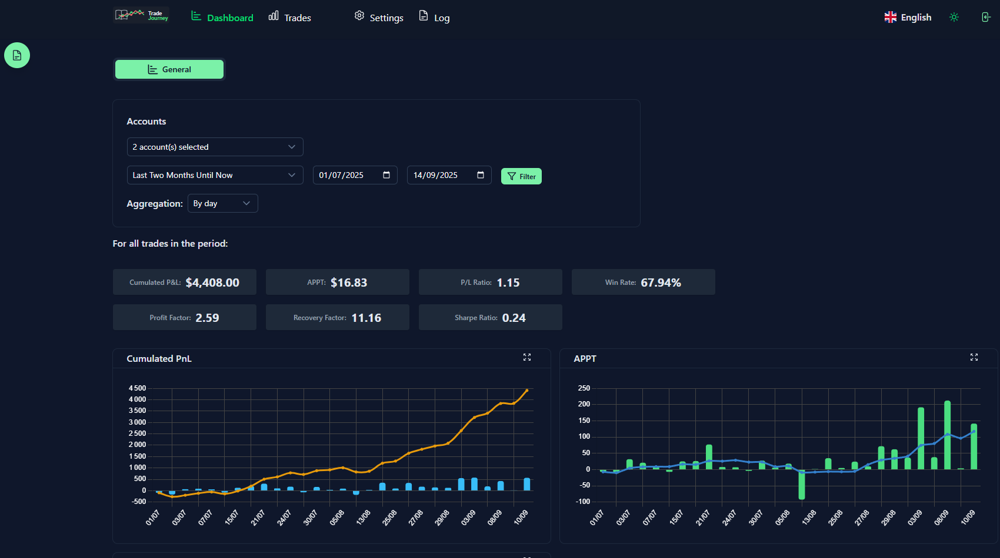

# 📊 TradeJourney - Trading Journal

**TradeJourney** is a modern trading journal web application built with Nuxt 4, allowing traders to track, analyze, and optimize their trading performance — fully local, nothing leaves your machine.

> 🚀 This project is actively evolving. New features and improvements are added regularly.

## ✨ Features

- 📈 **Trade Tracking**: Detailed recording of all your trades with P&L
- 📥 **Multi-Source Import**: MT5 (XLSX), NinjaTrader 8, Interactive Brokers, Quantower, Standard CSV, and live API connections
- 📊 **Advanced Analytics**: Performance charts (P&L, APPT, Win Rate, P/L Ratio, Sharpe Ratio, Profit Factor, Recovery Factor)
- 🗓️ **Trading Calendar**: Visualize profitable and losing days at a glance
- 📋 **Daily View**: Review trades, notes, and tags for any day
- 🏷️ **Tag System**: Organize trades by strategy, setup, or market context
- 📝 **Daily Notes**: Rich-text trading journal per day
- 📸 **Screenshots**: Attach chart images to your trades
- 🌓 **Dark/Light Mode**: Adaptable interface
- 🌍 **Multilingual**: English and French
- 📱 **Responsive**: Mobile and desktop
- 💾 **Backup/Restore**: Full database backup and restore
- 🔌 **Plugins**: Extend functionality without modifying core code
- 🏦 **Multi-Account**: Manage multiple trading accounts with starting capital tracking

<!-- 🖼️ SCREENSHOTS -->



> 📖 See the full documentation with screenshots and guides at [doc.tradejourney.app](https://doc.tradejourney.app)

## 🛠️ Technologies

- **Frontend**: Nuxt 3, Vue 3, TypeScript
- **UI**: Nuxt UI, TailwindCSS
- **Database**: PostgreSQL with multi-schema isolation
- **ORM**: Prisma
- **Charts**: Chart.js

## 🚀 Getting Started

### Docker (recommended)

```bash
git clone https://github.com/yopkool29/tradeJourney.git
cd tradejourney
cp .env.example .env
docker compose up -d --build
```

### Local (npm)

```bash
# Start PostgreSQL
docker compose -f ./docker-compose.dev.yml up -d
```

```bash
git clone https://github.com/yopkool29/tradeJourney.git
cd tradejourney
npm install
./scripts/reinit.sh
npm run dev
```

> 📖 For detailed installation guides (manual setup, environment variables, troubleshooting), see the [documentation](https://doc.tradejourney.app/en/getting-started/installation)

### 🔑 Default Login

- **Email**: `admin@mail.fr`
- **Password**: `admin`

## 📊 Features

### Trade Management
- Manual trade entry and editing
- Import from MT5 (XLSX), NinjaTrader 8, Interactive Brokers, Quantower
- Standard CSV import
- Live API import (NinjaTrader addon, IBKR Flex Query) and cloud storage server
- Multiple screenshots and rich text notes per trade (Milkdown editor)
- Custom trading symbols with aliases

### Analysis and Statistics
- **Interactive Charts**: P&L History, Cumulated P&L, Win Rate, APPT — draggable and customizable
- **Key Metrics**: P/L Ratio, Profit Factor, Recovery Factor, Expectancy ...
- **Net vs Gross P&L toggle**
- **Advanced Filters**: Symbol, type, date, lot, profit, tags
- **Detailed Sections**: All trades, Winning, Losing, and comparison views

### Tag System
- Customizable tag groups
- Colors and descriptions
- Advanced trade filtering by tags
- Daily / Trade tags for market context and journaling

## 🤝 Contributing

1. Fork the project
2. Create a feature branch (`git checkout -b feature/AmazingFeature`)
3. Commit your changes (`git commit -m 'Add some AmazingFeature'`)
4. Push to the branch (`git push origin feature/AmazingFeature`)
5. Open a Pull Request

## 📝 License

This project is licensed under the Apache 2.0 License. See the [LICENSE](LICENSE.txt) file for details.
I reserve the right to deploy the project on a server.

> ☁️ A managed cloud version may be offered in the future for those who prefer a hosted solution.

## 🆘 Support

- 🐛 Issues: [GitHub Issues](https://github.com/yopkool29/tradeJourney/issues)
